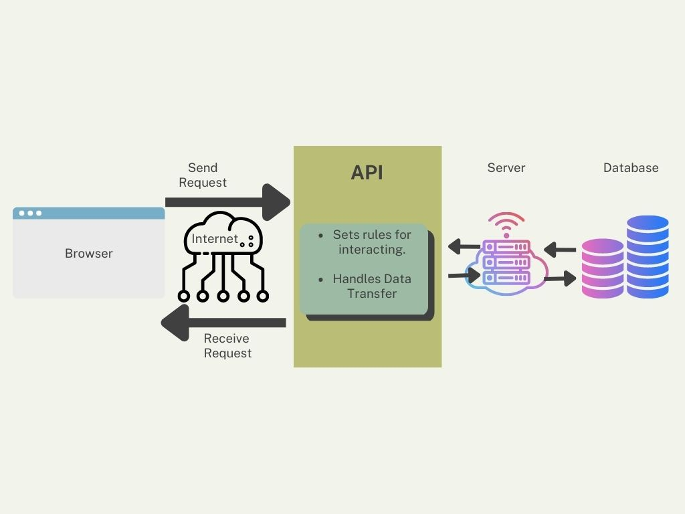
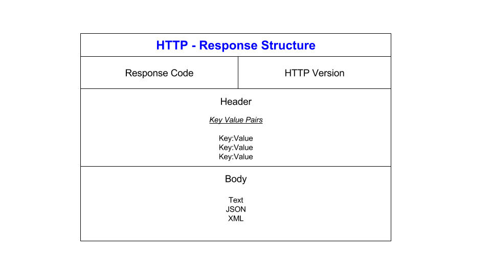

# API's

### What are API's? and how are the used?

API stands for Application Programming Interface. APIs are mechanisms that enable two software components to communicate 
with each other using a set of definitions and protocols. In the context of APIs, the word Application refers to any 
software with a distinct function. Interface can be thought of as a contract of service between two applications. 
This contract defines how the two communicate with each other using requests and responses. API architecture is usually 
explained in terms of client and server. The application sending the request is called the client, and the application 
sending the response is called the server. Shown in the diagram below:

### What is a REST API? and what makes it RESTful?

Representational State Transfer (REST) is a software architecture that imposes conditions on how an API should work. 
REST was initially created as a guideline to manage communication on a complex network like the internet. You can use 
REST-based architecture to support high-performing and reliable communication at scale. You can easily implement and 
modify it, bringing visibility and cross-platform portability to any API system.

API's are considered RESTful if they align to the six REST design principles,
also known as architectural constraints:
- Uniform Interface
- Client-server decoupling
- Statelessness
- Cacheability
- Layered system architecture 
- code on demand (optional)

## HTTP

### What is HTTP and what is it used for?

HTTP (Hypertext Transfer Protocol) is the set of rules for transferring files
such as text, images, sound, video and other multimedia files
over the web.

### HTTP request structure

An HTTP request is made from a client to a host located on the server in order to receive a resource needed to build 
the content. An HTTP request is made out of three components: request line, headers and message body.

### HTTP response structure

An HTTP response is made by a server to a client. The aim of the response is to provide the client with the resource it
requested, or inform the client that the action it requested has been carried out; or else to inform the client that an 
error occurred in processing its request. A HTTP response is also made up of three components: A status line, headers 
and a message body.

### 5 HTTP verbs

The 5 HTTP verbs are the most commonly used Methods when dealing with RESTful API's,
and they are:
- POST (The POST verb is most-often utilized to create new resources.)
- GET (The HTTP GET method is used to read (or retrieve) a representation of a resource.)
- PUT (PUT is most-often utilized for update capabilities)
- PATCH (PATCH is used for modify capabilities)
- DELETE (DELETE is pretty easy to understand. It is used to delete a resource.)

### Statelessness 
Statelessness means that every HTTP request happens in complete isolation. When the client makes an HTTP request, it 
includes all information necessary for the server to fulfill the request.

The server never relies on information from previous requests from the client. If any such information is important then
the client will send that as part of the current request.

### Caching
API caching is a process that places commonly requested objects in a secondary data store to avoid continuous calls 
to a primary database or any other type of data store.
